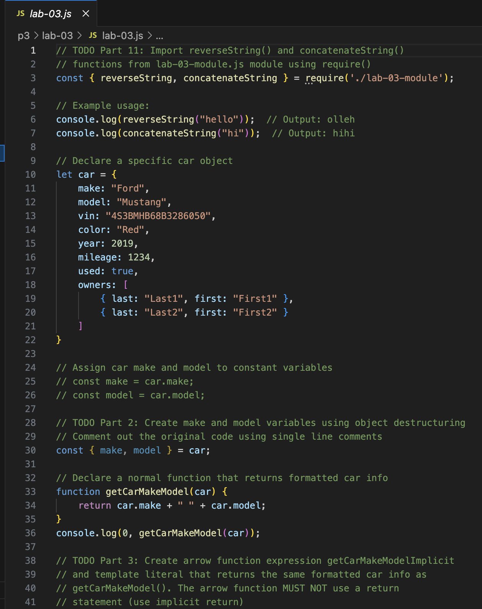
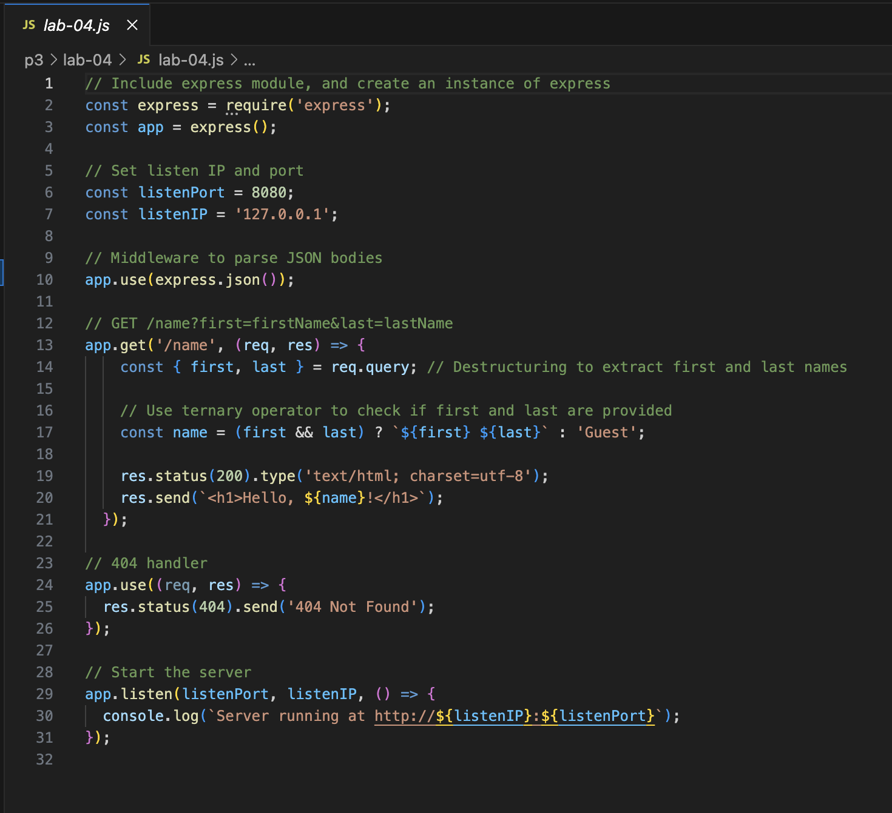
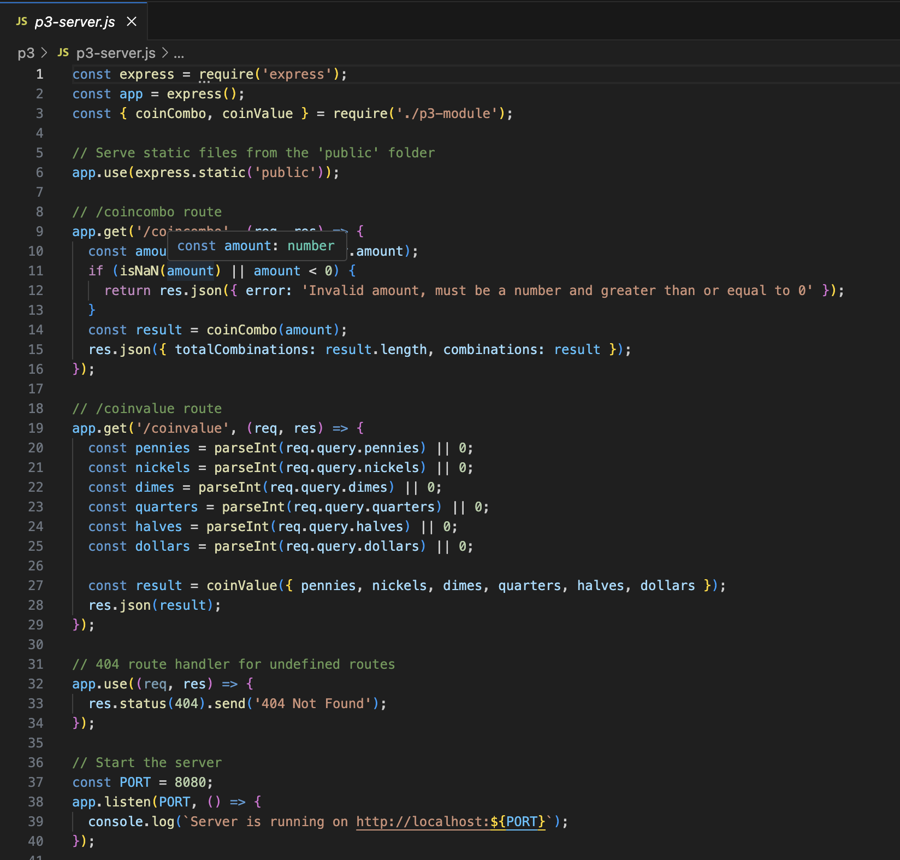

# CIT 281 Project 3

## Lab 3
Purpose: To practice refactoring JavaScript code using modern ES6+ syntax including destructuring, arrow functions, and iteration methods, and to create and import Node.js-compatible code modules.

Technologies: JavaScript (ES6+), Node.js, VSCode, module.exports, require

Learned: How to refactor traditional JavaScript functions into arrow functions, use destructuring with objects, iterate over objects and arrays with for..in and for..of, create and import modules in Node.js, and utilize the spread operator for cloning and merging data.

## Lab 4
Purpose: To create and test a Node.js Express server with GET and POST routes responding with JSON, and to use Postman for API testing including handling an array of student objects.

Technologies: Node.js, Express, Postman, JavaScript, VSCode

Learned: How to build REST API endpoints for GET and POST requests, organize data in server code, test APIs using Postman, and handle JSON data structures within an Express server.

## Project 3
Purpose: Build a modular Node.js Express REST API and web application to calculate US coin combinations and coin values, reinforcing modular programming, server routes, static file serving, and JSON handling.

Technologies: Node.js, Express, JavaScript (ES6+), CommonJS modules, HTML, Git, VSCode

Learned: Setting up a Node project with git, creating reusable code modules with exports/imports, implementing Express REST API routes with query parameters, serving static web pages, writing and testing coin calculation logic, and managing a .gitignore file.

